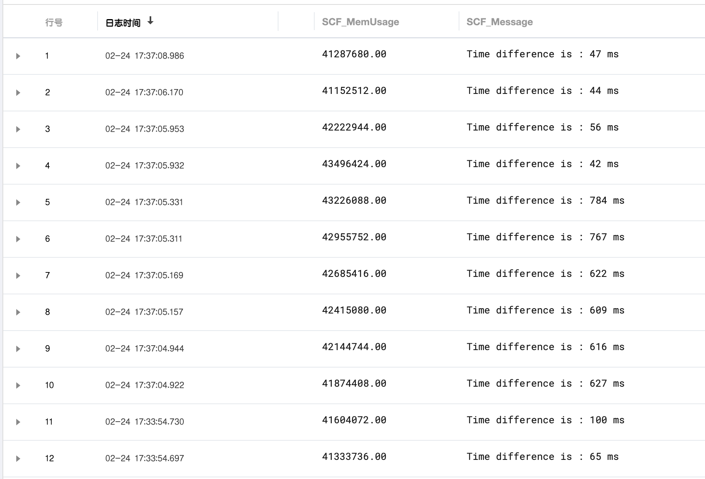

# SCF IoTHub Demo

## 配置设备信息

参考：https://github.com/tencentyun/iot-device-python/tree/master/hub

注意：需要区分 `证书认证` 和 `密钥认证` 两种形式，和 IoTHub中的产品配置保持一致

配置文件位置：  `./sender/device_info.json`

以 `证书认证` 的方式为例：

```json
{
  "auth_mode": "CERT",
  "productId": "MTLMHH630E",
  "deviceName": "my_device",
  "productSecret": "YOUR_PRODUCT_SECRET",
  "key_deviceinfo": {
    "deviceSecret": "xxxx"
  },

  "cert_deviceinfo": {
    "devCaFile": "./iot_device_key/ca.crt",
    "devCertFile": "./iot_device_key/my_device_cert.crt",
    "devPrivateKeyFile": "./iot_device_key/my_device_private.key"
  },
  "subDev": {
    "subdev_num": 4,
    "subdev_list": [
      { "sub_productId": "", "sub_devName": "" },
      { "sub_productId": "", "sub_devName": "" },
      { "sub_productId": "", "sub_devName": "" },
      { "sub_productId": "", "sub_devName": "" }
    ]
  },
  "region": "china"
}
```

## 发送MQTT消息

```bash
cd sender
openssl rand -hex 20 | xargs pyenv exec python3 example_mqtt.py 100
```

## 打包消息处理函数

整体的链路：`Device -> IoT Hub -> TDMQ -> Event Bridge -> SCF`, 其中SCF应用记录了整体的消息链路延迟，从`设备发送消息开始`到`SCF开始处理的事件`。


```bash
mvn package -f "./pom.xml"
```

构建产物：`target/cloud-1.0-SNAPSHOT.jar`

## 部署消息处理函数

1. 创建 TDMQ 的Topic和对应的消费组
2. 通过设置 IoT Hub的规则引擎，把消息转发到TDMQ
3. 创建Event Bridge的事件集，创建TDMQ连接器 
4. 配置事件集的事件规则，把部署之后的函数作为投递目标
5. 发送 MQTT消息进行测试，通过CLS监控链路延迟情况

CLS 查询语句：

```bash
"Time difference is" AND SCF_FunctionName:"java-demo" AND SCF_Qualifier:"$LATEST" AND SCF_Namespace:"default"
```



